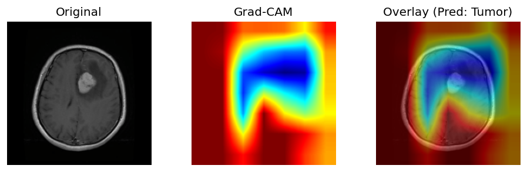
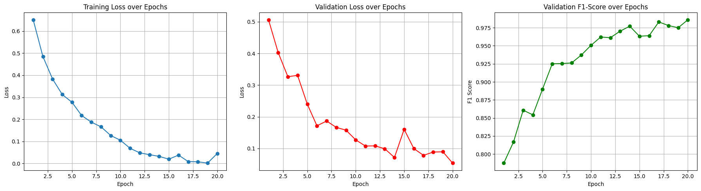

## Interpretable brain tumor classification from MRI scans Using CNN and Grad-CAM

> This project implements a convolutional neural network (CNN) to classify brain MRI images as **Healthy** or **Tumor**. 
> It includes **Grad-CAM** visualizations to interpret model decisions and validate that the model focuses on meaningful regions in the image.

#### Main functionalities

- Binary classification: **Healthy** vs **Tumor**
- Custom CNN architecture trained on brain MRI scans
- Training, validation, and evaluation pipeline in PyTorch
- Grad-CAM visualization for model interpretability
- ROC-AUC curve, confusion matrix, and full classification report

#### Sample results





#### Dataset

[download dataset from Kaggle](https://www.kaggle.com/datasets/murtozalikhon/brain-tumor-multimodal-image-ct-and-mri/data)

#### Technologies used

- Python, PyTorch
- Matplotlib, scikit-learn
- OpenCV, torchvision
- Grad-CAM for XAI (Explainable AI)

Clone this repository:

```bash
git clone https://github.com/GirmaSis/brain-tumor-mri-CNN-Grad-CAM.git
cd brain-tumor-mri-CNN-Grad-CAM
